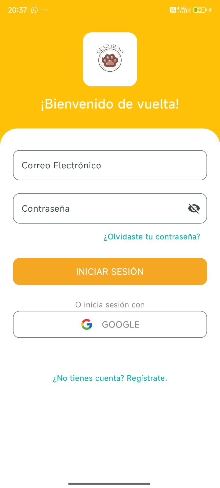
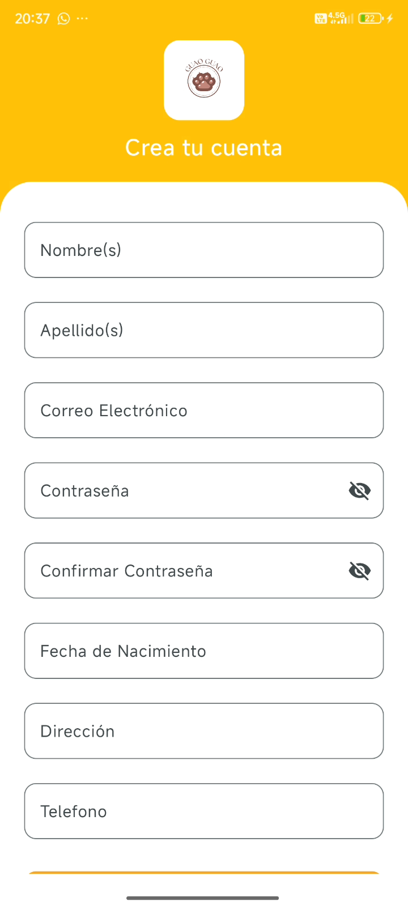
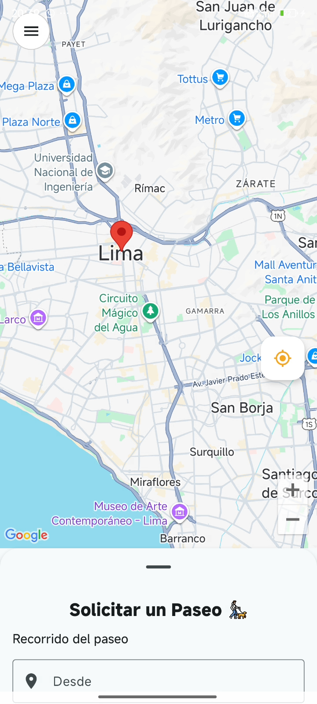
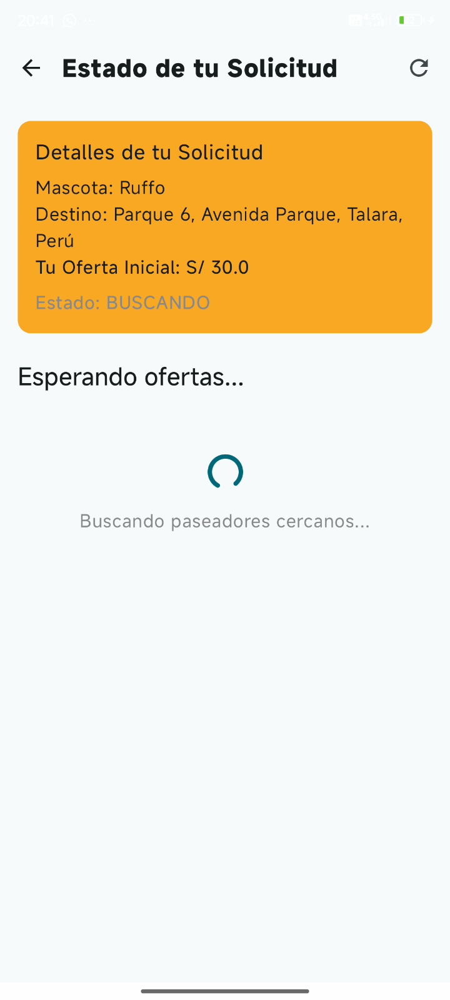
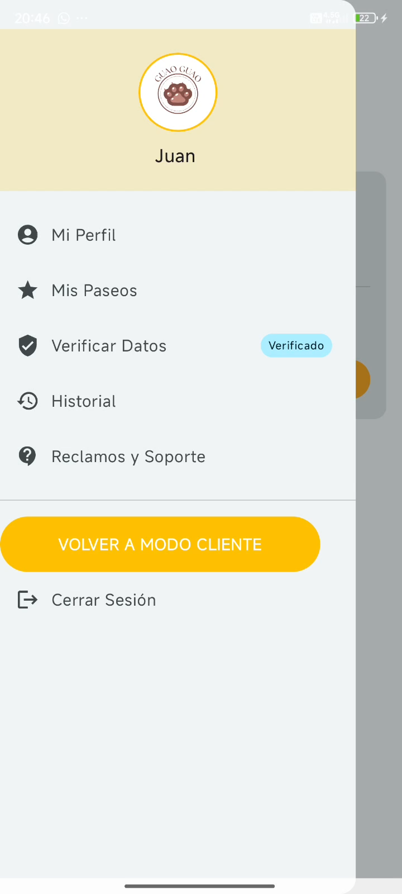
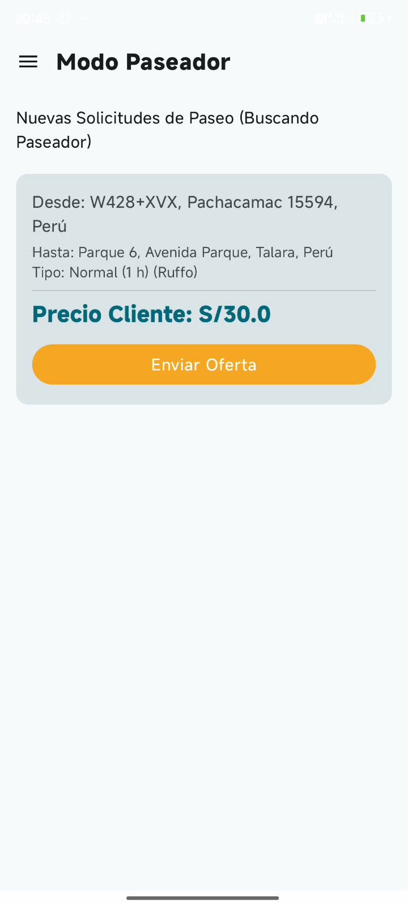

# GuauGoo - Pet Walking App

**GuauGoo** is an Android inDrive-style app for organizing and managing pet walks intuitively and visually.  
Built with **Kotlin**, **Jetpack Compose**, **Room**, and **Google Maps Platform**.

---

## 🧩 Features

- User login and registration  
- Pet and walk management  
- Entity relationships using Room  
- Maps and geolocation with Google Maps API  
- Data conversion for efficient storage  
- Modern and intuitive UI with Jetpack Compose

---

## 🚀 Technologies

- **Kotlin**  
- **Jetpack Compose**  
- **Room Database**  
- **Google Maps Platform**  
- **Android SDK 33+**  

---

## ▶️ Installation

1. Clone the repository:  
git clone https://github.com/SoyJeand/AppGuauGoo-PetWalksManager.git

3. Open the project in Android Studio

2. Set up your Google Maps API key in local.properties

3 . Run the app on an emulator or physical device

## 📱 App Screenshots

| Splash / Logo | Login |
|---------------|-------|
|  |  |

| Register | Home |
|----------|------|
|  |  |

| Client Request | Request Status |
|----------------|---------------|
|  |  |

| Walker Menu | Walker Requests |
|-------------|-----------------|
|  |  |

## 📖 Author

Jean Grober De la Cruz

LinkedIn
 | GitHub

